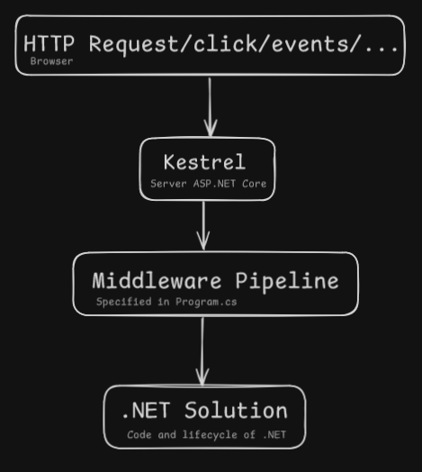

### 🗺️ The Road-to-Senior Plan

Este es tu mapa, basado en tu lista:

* **Phase 1: The Foundation (Junior)**
    * Focus: Basic concepts, configuration, and how .NET starts.
    * *Goal:* Understand "How it works" basics.
    * *Questions:* 1 to 7 from your list.

* **Phase 2: The Mechanics (Mid-Level)**
    * Focus: The server (Kestrel), Routing, Database (EF Core), and Async.
    * *Goal:* Build real features.
    * *Questions:* 8 to 14.

* **Phase 3: Architecture (Senior)**
    * Focus: Microservices, Design Patterns, Security, and Performance.
    * *Goal:* Design complex systems.
    * *Questions:* 15 to 25.

---

### 🚀 Let's Start: Phase 1 (Easy)

#### **Pregunta 1**: *What is .NET Core, and how does it differ from .NET Framework?*
**1. .NET Core vs. .NET Framework**

* **.NET Framework:**
    * It is **old** (legacy).
    * It runs **only on Windows**.
    * Ideally, we do not use it for new projects.

* **.NET Core (now just .NET 5/6/7/8):**
    * It is **new** and modern.
    * It is **Cross-Platform** (Multiplataforma). It runs on Windows, Linux, and Mac. 🐧🍎
    * It is **faster** (high performance).
    * It is **Open Source**.

> **Key Takeaway:** The most important difference is that **Core runs everywhere** (Linux/Mac/Windows), but **Framework is Windows only**.

---

### 🏠 The Startup.cs File

#### **Pregunta 2**: *What is the role of the Startup class?*

Think of your application like a **Restaurant**. The `Startup.cs` is the **Manager's Morning Checklist**. It runs only **once** when you open the restaurant (start the app).

It has **2 main jobs** (Methods):

* **ConfigureServices (The Kitchen Tools 🔪):**
    * This method is where you prepare the **tools** (Services) your application needs.
    * It uses **Dependency Injection (DI)** to load these tools into a container.
    * *Example:* "I need a Database connection", "I need an Email sender".

* **Configure (The Service Flow 🍽️):**
    * This method decides **how** to handle a customer (a User Request).
    * It sets up the **Pipeline** (the sequence of steps).
    * *Example:* First check Security -> Then check Routing -> Finally serve the Page.

> **Key Takeaway:** `ConfigureServices` prepares the **tools**, and `Configure` defines the **steps** to use them.

---

### 🔗 Middleware Components

**Pregunta 3**: *What are middleware components?*

#### **3. Middleware**

Imagine a **Water Pipe** or an **Assembly Line**. When a request comes in, it flows through several pieces of pipe. Each piece is a **Middleware**.

* **How it works:**
    * A middleware receives the request.
    * It can **do some work** (like logging or checking a password).
    * Then, it calls `next()` to pass the request to the **next middleware** in line. ➡️
    * OR it can **stop** the flow (Short-circuit) and send a response back immediately (e.g., "404 Not Found" or "401 Access Denied"). 🛑

* **Why Order Matters:**
    * The order is **critical**.
    * If you put the "Serve Files" middleware *before* the "Security Check" middleware, anyone can download your private files!
    * You must validate **before** you execute.

> **Key Takeaway:** Middleware are the **building blocks** of the request pipeline. They handle the request **in order**, one by one.

---

#### **4. Dependency Injection (DI)**

**Pregunta 4**: *How do you configure dependency injection in .NET Core?*

We configure Dependency Injection by calling simple methods in the `IServiceCollection` object (the list of tools).

**Example Code:**

```csharp
services.AddScoped<IEmailSender, EmailSender>(); 
services.AddTransient<ILogger, ConsoleLogger>(); 
```

When you register a service (like `EmailSender` or `ILogger`), you must choose a **Lifetime** (Tiempo de Vida). This tells the system how long the "tool" should live.

Understanding the **Lifetimes** is key to becoming a senior developer.

Let's explain what these **Lifetimes** mean. A **Lifetime** is the **rule** that tells the .NET system how long to keep an object alive (how long it lives).

Here is a table explaining the three main types:

| 🔑 **Lifetime** (Method) | 🌎 **What It Is** |  analogy (Analogía) | **When to Use** |
| :--- | :--- | :--- | :--- |
| **Transient** (`AddTransient`) | A **New** object **every time** you ask for it. | A **Disposable Toothbrush**. You use it once, then throw it away. | For objects that must **not** share data, like a complex calculator. |
| **Scoped** (`AddScoped`) | One object **per HTTP Request**. | A **Waiter** (Mesero). The same waiter helps one customer (request) from start to finish. | This is the **most common** type for MVC/APIs. Used for database connections (EF Core). |
| **Singleton** (`AddSingleton`) | **Only One** object for the **entire application**. | The **Restaurant Manager**. Only one person holds this job while the restaurant is open. | For things that **never change**, like configuration settings or a global logger. |

### ❓ Why use them?

We use these Lifetimes to control **Memory** and **Data Safety**:
* **Safety:** We do not want User A to see User B's data (Scoped helps here).
* **Memory:** We do not want to create the same big object (like the configuration manager) 100 times (Singleton helps here).

---

### ⚙️ IConfiguration vs. IOptions

#### **Pregunta 5**: *What is the difference between IConfiguration and IOptions in .NET Core?*

We talked about configuration being good for **Singleton**. Configuration is how your app reads settings (like database passwords, API keys, etc.) from `appsettings.json`.

* **`IConfiguration`:** This is the basic way to read settings. It gives you a **snapshot** (una foto) of the settings when the app starts.
* **`IOptions<T>`:** This is a modern way to read settings. It lets you bind configuration to a C\# class (`T`).

Here is the key difference: one can **update** settings automatically while the app is running (without restarting the server!).

### 🔄 IOptions vs. IConfiguration

Here is the simple explanation:

| Feature | IConfiguration | IOptions\<T\> |
| :--- | :--- | :--- |
| **Data Type** | Just `string` and `int` (basic types). | A **Class** (`T`) you define. |
| **Live Update** | **No**. It reads the file only once (snapshot). | **Yes**. It can read the file again if it changes. |
| **The Why** | For simple, static settings (e.g., connection string). | For strongly-typed configuration that **can change** (e.g., Feature Flags). |

**The key is `IOptions` gives you the settings as a clean C\# object.** This is much safer than reading strings from `IConfiguration`.

-----
### Appsettings.json

#### **Question 6**: *How does the `appsettings.json` file work in .NET Core?*

This file is where we store application **settings** (Configuración).

  * **Example:** Database connection string, logging levels, external API keys.

The `.NET Core` framework is very flexible about **where** it looks for settings. The file `appsettings.json` is the default place, but it can be overridden.

#### 📝 Configuration Sources

The `appsettings.json` file is just the **first step**. .NET Core can get settings from many places, and they work in a specific **order** (Priority).

Here are two other very important sources:

| Source | Simple English Explanation | Why is it Important? |
| :--- | :--- | :--- |
| **Environment Variables** 🖥️ | Settings stored **on the server** itself (Windows or Linux). | This is the best place for **Secrets** (like passwords), because the `appsettings.json` file might be public. |
| **Command Line** ⌨️ | Settings you write when you **start** the application. | This is useful for temporary changes or testing. |

**The Order (Priority):**
The setting that is defined **last** is the one that is used.

1.  **Command Line Arguments** (Wins!)
2.  **Environment Variables**
3.  **`appsettings.json`** (Loses)


---

### 🟢 Program.cs

We have finished the configuration part! Let's look at **Question 7**: *What is the significance of the Program.cs file in .NET Core applications?*

We discussed that `Startup.cs` is the **Manager's Checklist** (configures the services and the pipeline).

### 💻 Program.cs Explained

The `Program.cs` file is the **Entry Point** (punto de entrada) of your .NET Core application.

* **Role:** It is the code that **Builds and Runs** the **Host** (el anfitrión).
* **The Host:** The host is the actual server environment (the "box") that holds your application.
* **Key Action:** Inside `Program.cs`, you find the code that says: "Start the server, read the settings from `appsettings.json`, and use the rules from `Startup.cs`."

> 💡 **Modern Note:** In new .NET versions (like .NET 6+), the code from `Startup.cs` and `Program.cs` is now often **merged** into just `Program.cs` to make things simpler. But the job is the same!

---

## 🛠️ Phase 2: The Mechanics (Intermediate)

### Web Server (Kestrel)

#### **Question 8**: What is Kestrel, and why is it used in .NET Core?

**Explicacion**
**Kestrel** is the **Web Server** for ASP.NET Core. It is the first component that **receives** the HTTP request from the Internet. Think of it as the **"Front Door"** of your application. It is used because it is **fast** (high performance), secure, and works on **many operating systems** (Cross-Platform).

**Ejemplo**
Imagine your application is a **Restaurant**. Kestrel is the **Host** that opens the door, receives the customer request (HTTP), and directs it inside the kitchen (the Middleware Pipeline).

**Keytakeway**
Kestrel is the built-in, cross-platform **HTTP Listener** that starts the request flow.


| Bloque del Diagrama | Concepto Clave | Relación con la Arquitectura |
| :--- | :--- | :--- |
| **HTTP Request/click/events/...** | **El Cliente** | Es la petición que inicia el proceso, sea desde un navegador o cualquier otra aplicación. |
| **Kestrel** | **Web Server (Q8)** | Kestrel es el primer componente que **recibe y traduce** esa petición HTTP, pasándola al entorno de .NET. |
| **Middleware Pipeline** | **Flujo del Request (Q10)** | Es la lista ordenada de componentes que procesaste con `app.Use...` en `Program.cs`. Aquí es donde se manejan CORS (Q11), Autenticación, y **Routing** (Q9). |
| **.NET Solution** | **El Código Final** | Si la petición pasa todos los *Middlewares*, finalmente llega a tu **Controller** y al código que usa tu **Repository** y el **DbContext** (Fase 2). |



---

### Traffic Control

#### **Question 9**: Explain the concept of routing in ASP.NET Core.

**Explicacion**
**Routing** is the **Map** inside your application. It looks at the **URL address** (like `/notes/5`) and the **HTTP Verb** (GET, POST) and decides **which Controller method** must execute. It is the system that directs the traffic to the right piece of C# code.

**Ejemplo**
If the request is **POST** to `/notes`, Routing knows this must go to the `NotesController`'s `Post()` method. If the request is **GET** to `/notes/10`, Routing extracts the ID (`10`) and sends it to the `Get(int id)` method.

**Keytakeway**
Routing is the link between the **URL** and the **C# Method**.

---

### Startup Configuration (DI & Pipeline)

#### **Question 10**: What is the purpose of ConfigureServices and Configure methods in the Startup class?

**Explicacion**
These methods define how the application runs (now mostly merged into `Program.cs`):
* **`ConfigureServices`** (the `builder.Services` part): This is where you register all the application **tools** (services) for **Dependency Injection (DI)**.
* **`Configure`** (the `app.Use...` part): This sets the **pipeline** (the order of steps/Middleware) for the request flow.

**Ejemplo**
**`ConfigureServices`** registers the database tool (`AddDbContext`). **`Configure`** adds the security check (`UseAuthorization`) *before* the Routing to ensure security runs first.

**Keytakeway**
**`Services`** = Tools/DI setup. **`Configure`** = Middleware Order/Pipeline setup.

---

### Web Security

#### **Question 11**: How does ASP.NET Core handle cross-origin resource sharing (CORS)?

**Explicacion**
**CORS** is a **security rule** for web browsers that stops a website on one domain (e.g., `siteA.com`) from calling your API on a different domain (`yourAPI.com`) unless you specifically allow it. .NET handles this by adding a special **Middleware** (`app.UseCors()`) to the pipeline, where you specify **which domains** are safe to make calls.

**Ejemplo**
You configure CORS to allow requests only from your local React application at `http://localhost:3000` but block calls from any public domain on the internet.

**Keytakeway**
CORS is a **Middleware security check** for external **domains** that call the API.

---

### Database Communication

#### **Question 12**: What are the benefits of using Entity Framework Core (EF Core) in .NET Core applications?

**Explicacion**
**EF Core** is a tool (an **ORM** - Object-Relational Mapper) that translates **C# objects** into **SQL code** and vice versa.
* **Benefit 1 (No SQL):** You talk to the database using **C# objects** and C# syntax (LINQ) instead of writing raw SQL text.
* **Benefit 2 (Migrations):** You can **change the database structure** (like adding a new column) using C# commands, not manual SQL commands.

**Ejemplo**
Instead of writing `SELECT * FROM Notes;` (SQL), you write `_context.Notes.ToList();` (C# code that EF Core translates).

**Keytakeway**
EF Core is the **Object-Relational Mapper** that simplifies database access using C# code.

---

### Background Tasks

#### **Question 13**: Explain the role of the IHostedService interface in .NET Core and provide an example of how to implement it.

**Explicacion**
**IHostedService** is for **Background Tasks**. It allows you to run code **continuously** (always running) or on a **schedule**, separate from the normal API requests. It starts when the application starts and stops when the application stops.

**Ejemplo**
You implement `IHostedService` to create a service that **checks the database for pending emails** every 60 seconds and sends them. This task is always working in the background, without waiting for a user to click a button.

**Keytakeway**
IHostedService runs reliable, long-running **background jobs** within the host application.

---

### Performance and Scalability

#### **Question 14**: How does ASP.NET Core support asynchronous programming?

**Explicacion**
.NET supports Async with the keywords **`async`** and **`await`**. This is used for slow operations (like talking to a database or external API). When a thread hits an `await` call, it **stops waiting** for the slow result and goes to serve **another user's request**.

**Ejemplo**
The server is waiting for the DB to save a note (which is slow). If it uses `await`, the thread is free to handle a **second user's request** while waiting for the database response.

**Keytakeway**
Async/Await prevents **thread blocking** to significantly increase server **scalability** (handling more users).